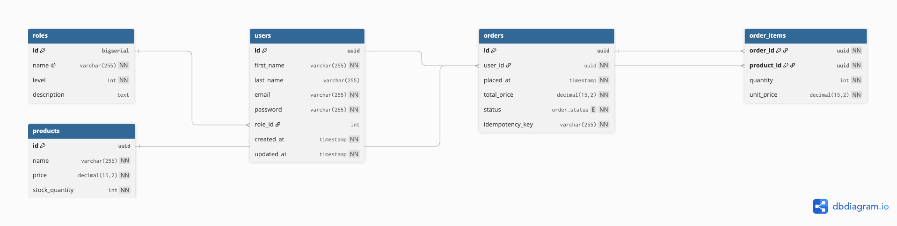

# Concurrent Order & Inventory Reservation Service


## Design Highlights

1. Authentication & Authorization:
    - Email and Password authentication. Passwords are hashed using the bcrypt library.
    - JWT with Refresh And Access Token. Access token is valid only for 15 minutes. Refresh is for 7 days
    - Refresh token is stored in a cookie jar with zero java script access preventing CSRF attacks
    - Refresh token is valid ONLY to the /v1/auth/refresh path.
2. Role Based Access Control:
    - Users and Admins
    - Users cannot crete products and manage the inventory
    - Users cannot see each other's orders (checkOrderOwnerShip middleware)
    - Administrators have access to orders and product management
    - Roles live in their own table, by design, so adding new roles later doesn't require a schema change.
3. Stale Order Cancellation:
    - Orders that are not confirmed within 15 minutes after creation are cancelled by a background janitor
    - Janitor runs every 5 minutes selecting fixed number of orders to prevent database bottlenecks and lock contention 
    - Cancellation process is ran in a database transaction
4. Caching:
    - Read-Aside caching strategy is used (the request first hits the cache. If it misses, it fallsback to the database)
    - Cached entities are: Users and Orders
    - Every cache miss will fetch the entity from the database and set it to cache for later use with 5 minute TTL
5. Docker and one-command-spin-up:
    ```sh
        docker compose up -d --build # with default env vars
    ```
    will get the service up and running for development, but when deploying set the env variables!

    Make sure port :5432, :6379, and :8080 are not in use before you start this service.
6. Admin Seeding:
    ```sh
    ADMIN_EMAIL=admin@example.com ADMIN_PASSWORD=adminpass DB=[the_pg_url] go run ./cmd/migrate/seed/
    ```
    The above command will create an administrator in the database. Do not forget to replace the [the_pg_url] with the database url
7. Documentation:
    - API documentations are generated by Swagger
    - Access path: /v1/swagger/index.html


## Database schema:

